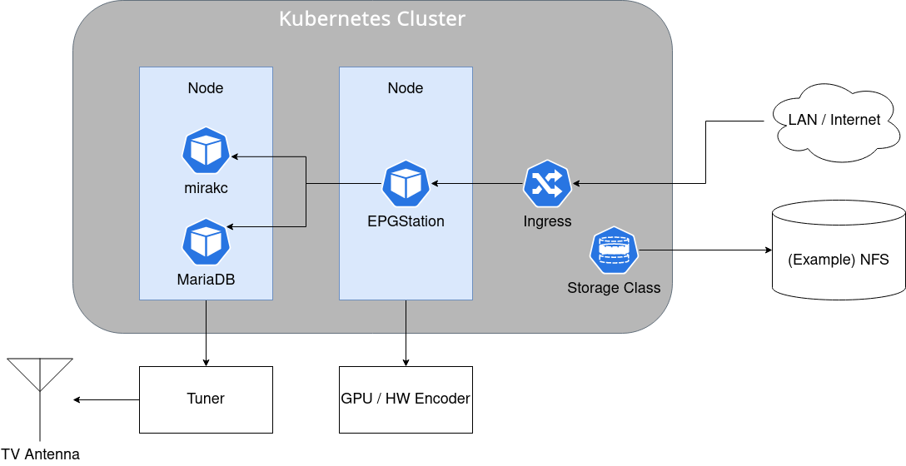

## tvrec

tvrec is a collection of manifests to deploy TV recording system on Kubernetes cluster.

It consists of the following cool OSS projects;

- [mirakc](https://github.com/mirakc/mirakc)
- [EPGStation](https://github.com/l3tnun/EPGStation)
- [MariaDB](https://github.com/MariaDB/server)

## Overview



## Quickstart

### Directory structure

```
k8s
+-- bases/              # Default configs
|   +-- epgstation/
|   +-- mariadb/
|   +-- mirakc/
+-- devices/            # Device-specific configs
|   +-- epgstation/     # GPU, SBC and so on
|   |   +-- xavier-nx/
|   |   +-- rpi4/
|   |   +-- ...
|   +-- mirakc/         # Tuners
|       +-- px-q1ud/
|       +-- ...
+-- overlays/           # Add configs for your environment into this directory
    +-- your_env_01/
    +-- ...
```

### Set up a new overlay for your environment

There are 2 ways to set up a new environment;

- Generate your configuration by script. (**described in this section**)
- If your environment already exists in `k8s/overlays/`, you can also copy and modify it.

In this section, we assume the directory name of your overlay is `k8s/overlays/mytvrec` for example.

First, you need to create a `generator.yml` including vairables for your environment.
You may want to make a copy of `generator.yml.template`.

```bash
cp generator.yml.template generator.yml
```

Then you need to edit variables in the file according to your environment.

> If you can't find your device's config in `k8s/devices`, you will need to add it. See [How to support a new device](#howtosupportanewdevice).

```yaml
# K8s Namespace to deploy tvrec
namespace: tvrec

# The tuner connected to your node. (directory name in `k8s/devices/mirakc`)
tuner: px-q1ud
# GPU or SBC name (direcotry name in `k8s/devices/epgstation`)
gpu: xavier-nx

epgstation:
  image: ghcr.io/octarect/epgstation:v2.6.2-ff60-xavier-nx
  # EPGStation volume size (Sufficient capacity to store video files)
  volume_size: 64Gi
  # Domain name used by ingress
  domain: tvrec.example.com

mariadb:
  volume_size: 4Gi

mirakc:
  image: ghcr.io/octarect/mirakc:2.1.0

timezone: Asia/Tokyo
```

Finally, you can generate an overlay for your environment by running the following command;

```bash
make new-overlay OVERLAY_NAME=mytvrec
```

### Deploy

Run the following command to deploy tvrec;

```bash
kustomize build k8s/overlays/mytvrec | kubectl apply -f -
```

## TIPS

### How to support a new device

```
k8s/devices/(mirakc|epgstation)
+-- <device_name>
    +-- kustomization.yaml
    +-- ...
```

You may want to refer each project's README
To write a config file, README for each project may be helpful.

#### mirakc

| File       | document                                                                             |
|:-----------|:-------------------------------------------------------------------------------------|
| config.yml | [mirakc/mirakc- readme.md#quick start](https://github.com/mirakc/mirakc#quick-start) |

#### EPGStation

> We have `config.yml.template` instead of `config.yml` because a password of mariadb is contained in the file

| File                | document                                                                                                                   |
|:--------------------|:---------------------------------------------------------------------------------------------------------------------------|
| config.yml.template | [l3tun/EPGStation - doc/conf-manual.md#stream](https://github.com/l3tnun/EPGStation/blob/master/doc/conf-manual.md#stream) |
| enc.js              | [l3tun/EPGStation - doc/conf-manual.md#encode](https://github.com/l3tnun/EPGStation/blob/master/doc/conf-manual.md#encode) |

## Contributing

Any pull requests are welcome. We consider you have granted non-exclusive right to your contributed code under [Apache-2.0 license](./LICENSE). Use https://github.com/octarect/tvrec/issues for discussion.
